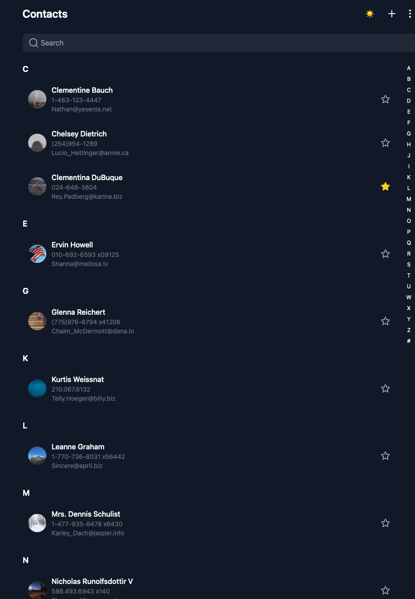

# Contacts Management App

A modern contact management application built with React and Vite.js, featuring a clean UI with dark/light mode and real-time search functionality.

## Live website on Netlify

- https://z-contact.netlify.app




## Features

- 👥 Contact list with data from JSONPlaceholder API
- 🌓 Dark/Light mode toggle
- 🔍 Real-time search across name, email, and phone
- 📱 Responsive design
- ⚡ Fast loading with Vite.js
- 🎨 Modern UI with Tailwind CSS

## Getting Started

### Prerequisites

Before running the application, make sure you have:

- Node.js installed (v14.0 or later)
- npm (comes with Node.js)

### Installation

1. Clone the repository

```bash
git clone https://github.com/zmn17/contact-app
cd contacts-app

2. Install dependecies

  npm install

3. Running the application

  npm run dev
  Open your browers and navigate to 'http://localhost:5173'


## Dependencies
- React
- Vite
- Tailwind CSS
- Lucide React
- API Services:
  - JSONPlaceholder (contacts data)
  - Picsum Photos (avatar images)


```
